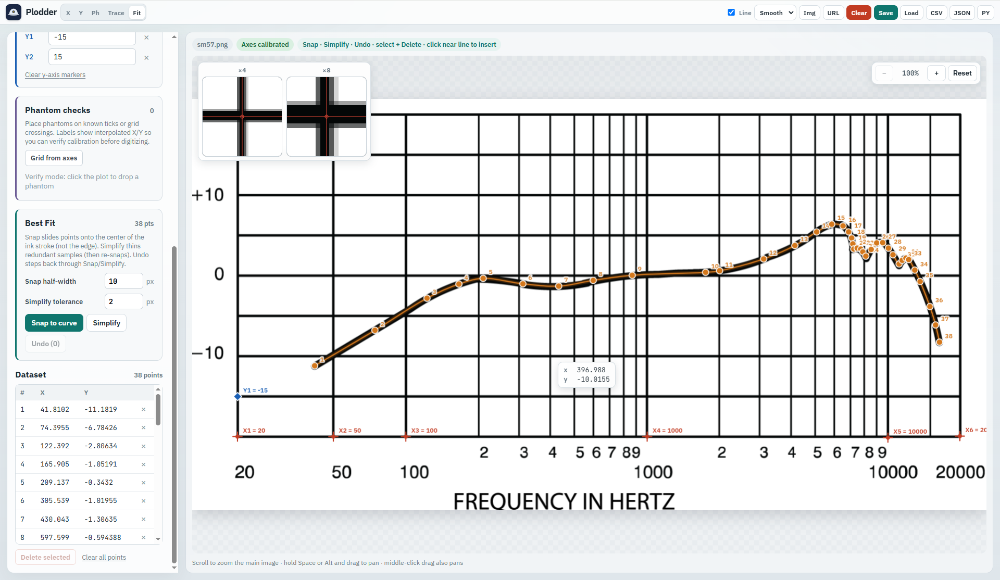

# Plodder

<p align="center">
  
</p>

<p align="center">
  
</p>

<p align="center">
  <a href="https://codebrain.github.io/plodder/"><strong>Try Plodder online</strong></a>
</p>

**Plodder** is a standalone local plot digitizer. Upload a graph image, calibrate axes with multiple X/Y markers, verify with phantom points, digitize with a smoothed line overlay, refine with Best Fit (snap + simplify + undo), and export CSV, JSON, or Python.

## Features

- **Multiple axis calibration points** — piecewise fit for accurate scales
- **Phantom verification points** — place or auto-generate grid phantoms labeled with interpolated X/Y
- **Main-image zoom & pan** — scroll to zoom, Space/Alt+drag to pan
- **Smoothed Trace line overlay** — Catmull-Rom curve through points
- **Best Fit** — snap points onto the ink using local curve slope; simplify redundant points; undo stack
- **Save / load project** — resume calibration and digitized points (`.plodder.json`)
- Linear, Log₁₀, Logₑ, Log₂, reciprocal, √x, x², and asinh scales

## Requirements

- Node.js 20+
- A modern browser (runs entirely client-side; no backend)

## Run

```bash
npm install
npm run dev
```

Then open the URL Vite prints (usually `http://localhost:5173`).

```bash
npm run build    # typecheck + production build → dist/
npm run preview  # serve the production build locally
npm run lint     # oxlint
```

## Workflow

1. Upload or drop a plot image (or load from URL)
2. **Calibrate X / Y** — markers are seeded on a detected plot rectangle when possible; drag/add markers and enter known values (≥2 per axis). Use **Log₁₀** (etc.) for log plots.
3. **Phantoms** — optional checks on known ticks
4. **Trace line** — left-click to add points; right-click to delete; click near the line to insert
5. **Best Fit** — **Snap to curve**, **Simplify**, **Undo**
6. **Save project** and/or export CSV · JSON · Python

## Save & resume

**Save** downloads a self-contained `.plodder.json` with the image, X/Y calibration markers, phantoms, and digitized points. **Load** (or drop the file) restores the session so you don’t recalibrate.

## Project layout

```
src/
  App.tsx                 # UI composition
  types.ts                # Shared domain types
  hooks/                  # Session, Best Fit, view transform
  components/             # Canvas, panels, toolbar
  lib/                    # Calibration, export, geometry, project I/O
```

All digitizing math lives in this repo (no external CV or charting libraries). Runtime dependency: React only.

## GitHub Pages

Pushes to `main` build and deploy via [`.github/workflows/pages.yml`](.github/workflows/pages.yml).

1. Ensure the repository name matches `PAGES_BASE_PATH` in the workflow (default `/plotter/`).
2. In the repo: **Settings → Pages → Source: GitHub Actions**.
3. Push `main` (or run **Actions → Deploy to GitHub Pages → Run workflow**).

Local production build with the Pages base path:

```bash
# PowerShell
$env:VITE_BASE_PATH="/plotter/"; npm run build; npm run preview
```

```bash
# bash
VITE_BASE_PATH=/plotter/ npm run build && npm run preview
```

## License

Licensed under the [Apache License 2.0](LICENSE).
